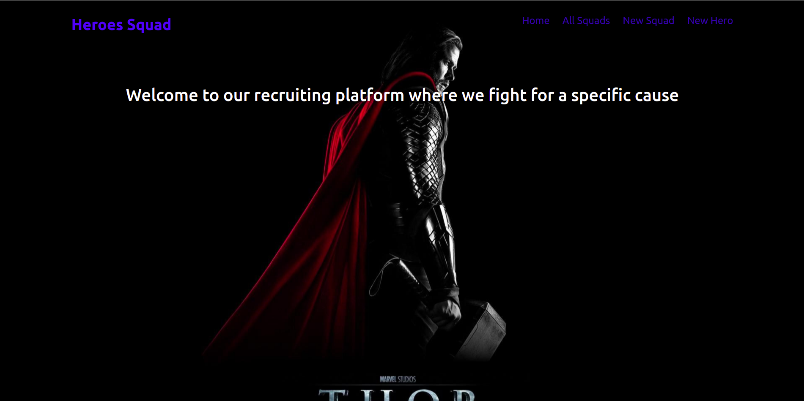

# Hero Squad
#### Hero Squad, December 15th 2021
#### By **Brian Muigai**



## Author's name
Brian Muigai


## TOC

- [Installation](#Installation)
- [Live Demo](#Tests)
- [Tests](#Tests)
- [Requirements](#Requirements)
- [Known Bugs](#Extras)
- [Extras](#Extras)


## Technologies Used
[](https://forthebadge.com)
[](https://forthebadge.com)
[](https://forthebadge.com)


## Description

```bash
HeroSquad is a web app app built using java-spark framework it allows one to recruit a well-balanced team of superheroes,
where at the very least, they should have a name, age, special power and weakness.
The heroes should also have a max size, name, and a cause
a hero can only participate in one Squad at a time.
```

## Installation
* `git clone <https://github.com/brianmuigai96/Hero-Squad-IP.git>` this repository
* `cd HeroSquad`

## Tests

- To run test, run files under tests/java package for tests.


## User Requirements
```bash
The applications allow users to do the following:
1.Add a new squad
2.Add a new hero in the squad
3.Add a squad name , size and a cause
4.View a list of current squads
3.View a list of heros in a squad

```


## Known Bugs
- Quick note that The page loads a bit slow due to the hosting, kindly be a little patient everything works just fine.
- There are currently no tests done for this project
- As at the time this project was made, responsiveness was not a major concern 
- The project is currently not being maintained any more 
- Thanks for understanding.


## Extras

- This project is no longer maintained. But if you want to contribute reach out to me via the details below 

## Contact Details
```bash
You can contact me at muigaibrian.com
```

## License

- This project is licensed under the MIT Open Source license Copyright (c) 2021

